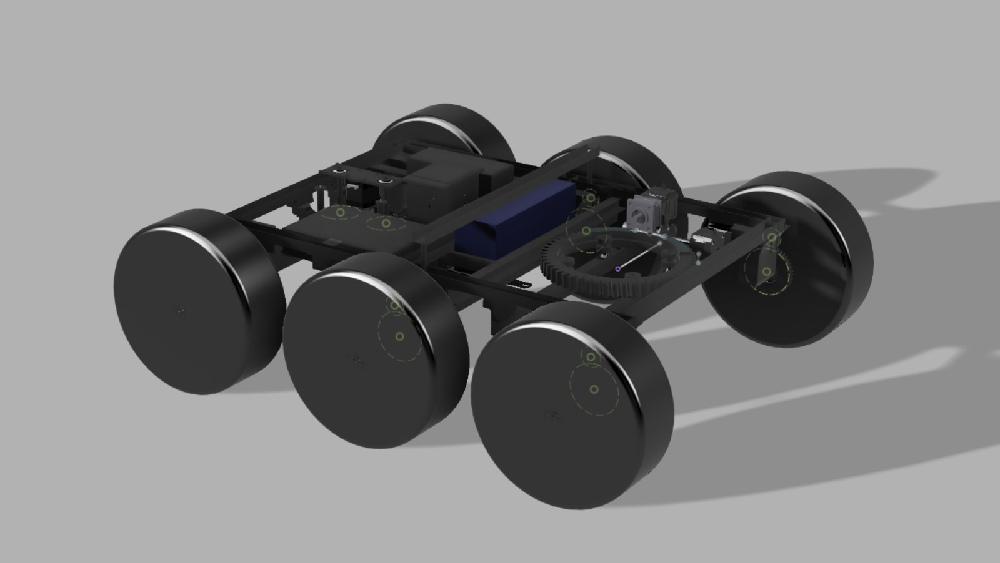
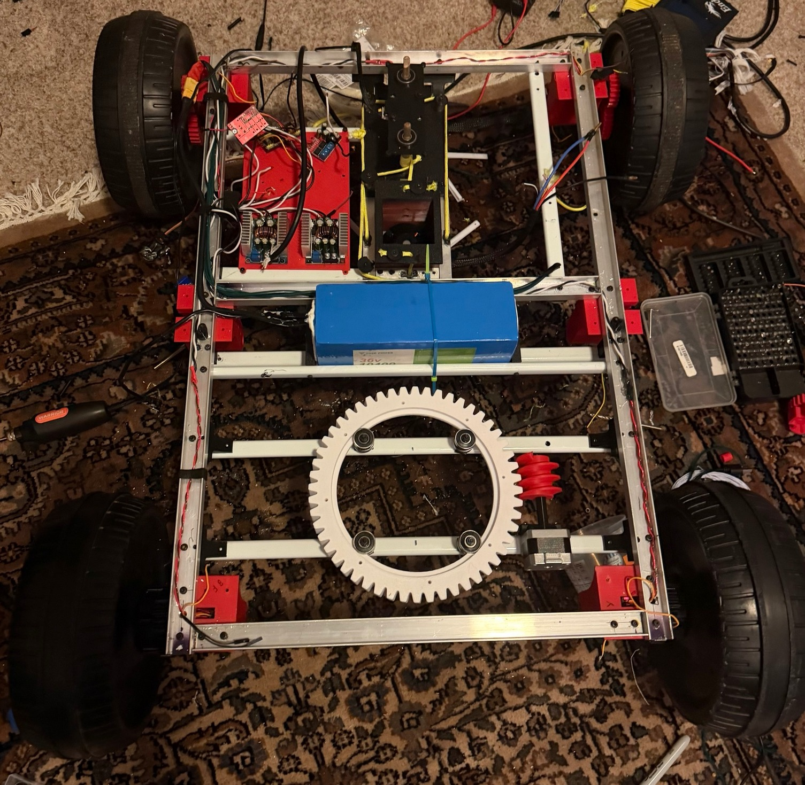
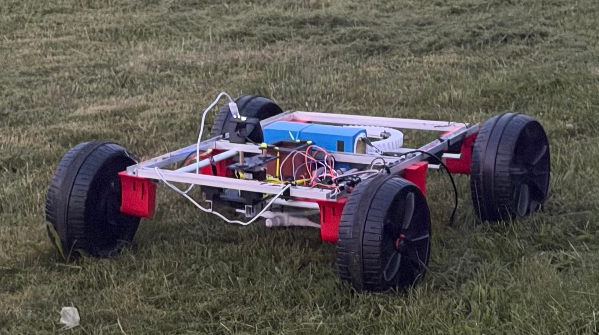

# Autonomous Garden Management System (GMS)

The **Autonomous Garden Management System**, or **GMS**, is an early-stage, low-cost autonomous garden maintenance robot for mowing, watering, hose aiming, and modular garden tooling.

The platform is built around an aluminum-channel chassis, a 36V power system, a front mower module, a rope-based mower lift, and a rear tooling area that is being developed around a hose turret. GMS is designed for autonomous operation, but this repository should be read as a build log for work in progress, not as documentation for a finished commercial product.

## Current Build Status

This project is still being worked on.

Completed or mostly complete:

- Drivetrain mechanical build
- Front mower module
- Mower up/down lift mechanism using a custom rope-based lift system
- FOC mower motor controller wiring
- Front section of the robot
- Phase 1 of the hose turret: worm-gear rotating base for the first degree of freedom

In progress:

- Rear section of the robot
- 2-DOF hose turret
- Hose docking interface for a base station
- ESP32-P4 high-level control software
- STM32 F103 low-level control firmware
- Wiring cleanup, control box layout, and test documentation

Planned:

- Second hose turret degree of freedom for up/down hose angle
- Autonomous hose attach/detach behavior when parked at the base station
- Plant-targeted watering
- Controlled liquid application module, tested with water first
- Field testing, logging, and updated cost tracking

## Project Goals

- Keep the core platform inexpensive, with a target core platform cost around $250 once the BOM is finalized.
- Use common hardware-store and commodity electronics parts where practical.
- Build a mechanically useful outdoor robot instead of a fragile display-only prototype.
- Support mowing, watering, hose aiming, and modular rear garden tooling.
- Use microcontrollers for control instead of an expensive Raspberry Pi 5-class SBC.
- Document the design honestly as it is built, tested, changed, and improved.

## Mechanical Overview

The chassis uses around 16 feet of aluminum channel from Lowe's as a cheap but robust frame material. Aluminum channel keeps the frame accessible and easy to modify while still giving the robot a real outdoor structure.

The aluminum-channel frame also has slight compliance. That flexibility may help the robot handle rough terrain better than a fully rigid chassis, although this still needs outdoor testing.

The robot is split into two main areas:

- **Front section:** drivetrain, mower module, mower lift, battery placement, and main mower electronics.
- **Rear section:** hose turret, base-station hose interface, and future modular garden tooling.

## Mower System

The mower module uses a C6374-class BLDC motor with high peak-power capability. The robot is a 36V system. The motor/controller hardware has high burst capability, while normal cutting use is expected to be far lower than the hardware peak.

The current mower controller is a low-cost ODrive-style FOC controller, around $40, for torque-capable BLDC control. A simpler version of the robot could use a cheaper sensorless e-bike-style BLDC controller if precise torque control is not required.

## Rope-Based Mower Lift Mechanism

The mower up/down mechanism is mechanically complete and uses a custom rope-based lift system. The purpose is to raise and lower the mower assembly without requiring a heavy linear actuator or expensive mechanical stage.

The lift mechanism still needs repeated load testing, position repeatability checks, and safety validation before it should be trusted during autonomous operation.

## Drivetrain

The drivetrain uses DS3240 servos repurposed as drivetrain motors. This is much cheaper than many traditional robotics drivetrain motor options and fits the low-cost design philosophy of the project.

The drivetrain is mechanically done. Low-level control work will use STM32 F103 Blue Pill boards for encoder reading, motor PWM, BTS7960 control, and sensor I/O.

## Electronics Architecture

GMS uses a distributed microcontroller architecture:

- **ESP32-P4:** high-level controller for autonomy logic, subsystem coordination, and behavior planning.
- **2x STM32 F103 Blue Pill boards:** low-level controllers for encoder reading, motor PWM, BTS7960 control, and sensor I/O.
- **BNO085 IMU:** orientation and motion sensing.
- **Low-cost ODrive-style FOC controller:** BLDC mower motor control.
- **36V battery system:** main robot power bus, with lower-voltage regulation for logic electronics.

This architecture keeps the robot cheaper and more embedded than a Raspberry Pi 5-class SBC design while leaving enough control capability for mowing, watering, docking, and modular tooling experiments.

## Control Box

The control box is intended to organize and protect the electronics rather than simply hold loose wiring. It will contain the ESP32-P4, STM32 boards, motor driver wiring, power distribution, signal isolation/protection, sensor wiring, safety disconnects, and debug access.

The control box is still in progress. Wiring should be treated as experimental until fusing, strain relief, connector labeling, grounding, and emergency shutoff behavior are fully tested.

## Watering Turret

The rear turret is being developed as a 2-DOF hose aiming module.

Phase 1 is the worm-gear rotating base for the first degree of freedom. The second degree of freedom, which will raise and lower the hose angle, will be built later.

The robot will connect to a base station with a hose attachment. When parked at the base station, the hose can be autonomously attached or detached. The hose turret can then aim water toward plants.

There may also be a small rear-mounted pump/container module for controlled liquid application. Any testing should be done with water first, and any future use must follow local rules, product labels, and safety requirements.

## Cost Philosophy

The cost goal is a target core platform cost around $250, but that should not be treated as a final claim until the BOM is complete.

The main cost-saving choices are:

- Aluminum-channel frame material
- ESP32-P4 high-level controller instead of an expensive SBC
- STM32 F103 Blue Pill boards for low-level real-time control
- DS3240 servos repurposed as drivetrain motors
- Commodity BTS7960 motor drivers
- Low-cost ODrive-style FOC controller for the mower motor
- 3D-printed and hand-built mechanical modules

See [BOM.md](BOM.md) and [docs/cost_breakdown.md](docs/cost_breakdown.md) for the working cost notes.

## Repository Status

This repository currently contains public documentation and placeholders for firmware, CAD, hardware notes, wiring diagrams, and tests.

The documentation is intentionally conservative. Subsystems are marked as complete only when they are mechanically built or wired, and autonomous behavior is described as designed or planned until it is tested.

## Safety Notice

This is an experimental outdoor robotics project with high-current electrical systems, rotating mower hardware, drive motors, and liquid handling. Treat the mower module and drivetrain as dangerous during testing.

Use guards, fuses, emergency shutoff, controlled test areas, and safe standoff distance. Test drivetrain behavior with the mower disabled first. Test liquid systems with water first.

See [SAFETY.md](SAFETY.md) for more detailed safety notes.

## Media

Current build progress and outdoor drive testing photos are shown below.

Additional media will be organized in [media/](media/README.md) as the project develops.

## Documentation

- [Roadmap](ROADMAP.md)
- [Bill of Materials](BOM.md)
- [Safety](SAFETY.md)
- [System overview](docs/system_overview.md)
- [Mechanical design](docs/mechanical_design.md)
- [Electronics architecture](docs/electronics_architecture.md)
- [Build status](docs/build_status.md)

## License

This repository is released under the MIT License.

Please preserve the copyright and attribution notices in [LICENSE](LICENSE) and [NOTICE](NOTICE) when copying, modifying, or redistributing substantial portions of the project.
